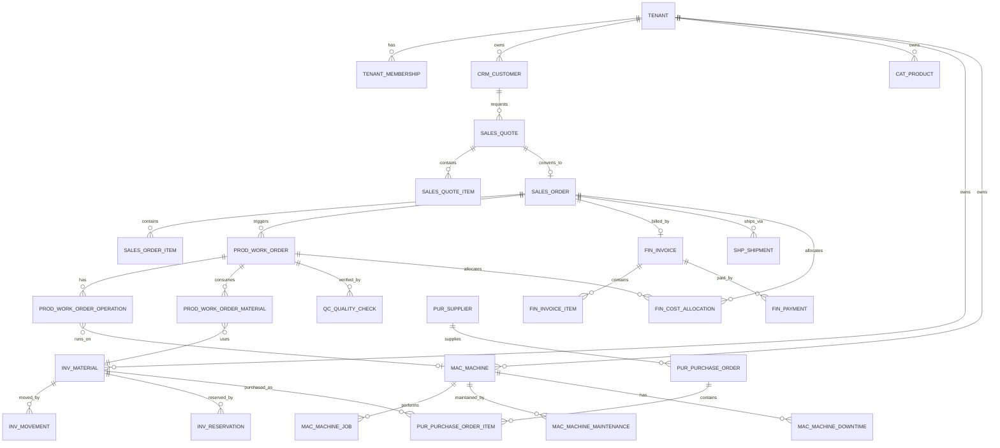
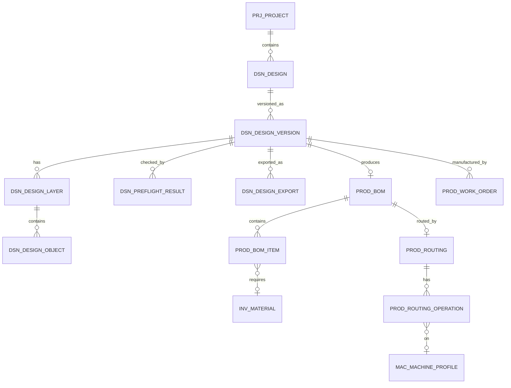
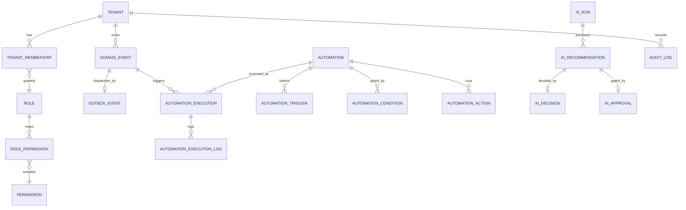

# INGLY OS V2 — Entity Relationship Diagram (ERD)

> Fase 3 · solo documentazione. ERD testuale (Mermaid) delle entità principali e
> delle relazioni canoniche. Attributi ridotti alle chiavi per leggibilità; lo
> schema completo è in `database-v2.md`. Nessuna tabella creata.

## 1. Core commerciale + produzione + finanza

## 2. Design → produzione

## 3. Sicurezza, eventi, automazione, AI, audit

## 4. Note di lettura
- `||--o{` = uno-a-molti; `}o--o|` = molti-a-uno opzionale; `||--o|` = uno-a-uno
  opzionale.
- Tutte le entità business portano `tenant_id` (relazione con `TENANT` implicita
  anche dove non disegnata per non appesantire).
- Tabelle immutabili (movimenti, eventi, pagamenti, audit) non hanno relazioni di
  "update/delete": sono append-only.
